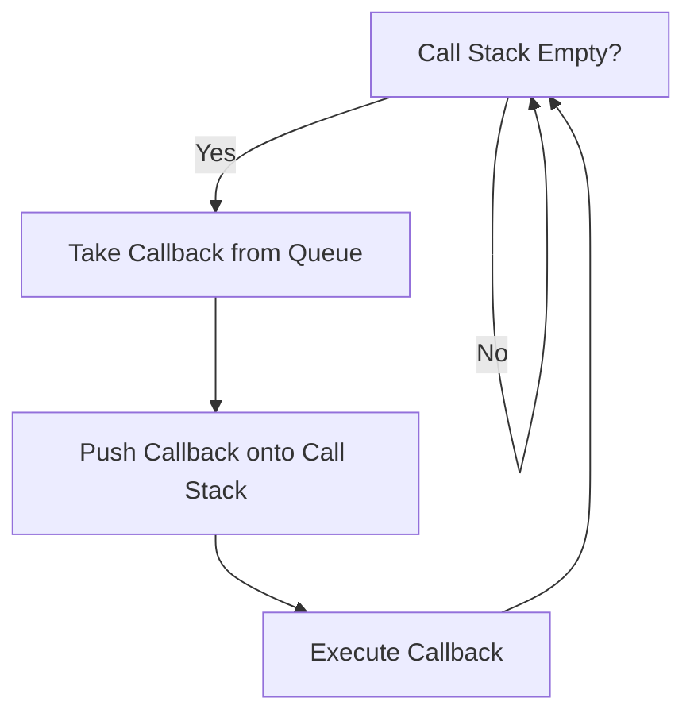

# What the Heck is the Event Loop Anyway?

By Philip Roberts

As JavaScript developers, we've all encountered the event loop in some form or another. But have you ever stopped to wonder what exactly the event loop is and how it works under the hood? Let's dive deep into the mechanics of JavaScript's event loop and demystify its inner workings.

## Introduction

About 18 months ago, as a professional JavaScript developer, I realized I didn't fully understand how JavaScript actually works. Terms like V8, single-threaded, and callbacks were familiar, but how they all fit together was a bit hazy. This led me on a journey to explore the event loop and its role in JavaScript's concurrency model.

## JavaScript Runtime and the Call Stack

At its core, JavaScript is a single-threaded language, meaning it has a single call stack and can do one thing at a time. The call stack is a data structure that keeps track of function calls:

```javascript
function multiply(x, y) {
  return x * y;
}

function square(n) {
  return multiply(n, n);
}

function printSquare(n) {
  const result = square(n);
  console.log(result);
}

printSquare(5); // Outputs: 25
```

When `printSquare(5)` is called, it gets pushed onto the call stack. Then `square(5)` and `multiply(5, 5)` are added to the stack in turn. Once `multiply` returns, each function is popped off the stack.

### Blocking the Call Stack

What happens when we have slow, blocking code?

```javascript
console.log('Start');
while (true) {
  // Infinite loop blocks the call stack
}
console.log('End'); // This line is never reached
```

In this example, the infinite loop blocks the call stack, preventing any further code execution or user interaction. In a browser environment, this would freeze the UI, leading to a poor user experience.

## Introducing Asynchronous Callbacks

To handle operations that take time (like network requests), JavaScript uses asynchronous callbacks. This allows the main thread to continue executing while waiting for other operations to complete.

```javascript
console.log('Hi');

setTimeout(() => {
  console.log('There');
}, 5000);

console.log('JSConfEU');
```

**Output:**

```
Hi
JSConfEU
There
```

Here, `setTimeout` defers the execution of the callback function, allowing the main thread to proceed.

## The Event Loop in Action

So, how does the event loop manage asynchronous operations?

1. **Web APIs**: Functions like `setTimeout`, XHR, and DOM events are provided by the browser (not the JavaScript engine) and run in the background.
2. **Callback Queue**: Once an asynchronous operation completes, its callback is added to the callback queue.
3. **Event Loop**: Continuously checks if the call stack is empty. If it is, it takes the first callback from the queue and pushes it onto the stack for execution.

### Visual Representation



### Understanding `setTimeout(0)`

Using `setTimeout` with a delay of 0 milliseconds doesn't execute the callback immediately. Instead, it defers the execution until the call stack is clear.

```javascript
console.log('Hi');

setTimeout(() => {
  console.log('There');
}, 0);

console.log('JSConfEU');
```

**Output:**

```
Hi
JSConfEU
There
```

This can be useful when you want to ensure that a function runs after the current execution context is complete.

## Asynchronous vs. Synchronous Callbacks

Not all callbacks are asynchronous. For example, array methods like `forEach` use synchronous callbacks:

```javascript
const array = [1, 2, 3];

array.forEach(item => {
  console.log(item); // Synchronous
});

console.log('Done');
```

**Output:**

```
1
2
3
Done
```

If we create an asynchronous version:

```javascript
array.forEach(item => {
  setTimeout(() => {
    console.log(item); // Asynchronous
  }, 0);
});

console.log('Done');
```

**Output:**

```
Done
1
2
3
```

## The Impact on Rendering

Heavy computation or synchronous loops can block the call stack and prevent the browser from rendering, leading to a sluggish UI.

```javascript
// Blocking the event loop
for (let i = 0; i < 1e9; i++) {
  // Some heavy computation
}

// The browser can't render or respond to user interactions here
```

By breaking tasks into asynchronous chunks, we allow the browser to handle user interactions and rendering between executions.

## Debouncing and Throttling

When dealing with events that fire rapidly (like scroll or resize), it's essential to manage how frequently your event handlers run to prevent flooding the callback queue.

```javascript
window.addEventListener('scroll', () => {
  // Debounced or throttled function
});
```

Using techniques like debouncing or throttling, you can optimize performance and ensure smooth user experiences.

## Tools for Visualization

To better understand these concepts, I built a tool called Loupe that visualizes the JavaScript runtime in action. It simulates the call stack, event loop, and callback queue, helping developers see how their code executes over time.

[Check out Loupe here](https://latentflip.com/loupe/)

## Conclusion

Understanding the event loop is crucial for writing efficient and non-blocking JavaScript code. By grasping how asynchronous callbacks, the call stack, and the event loop interact, you can build applications that are responsive and performant.

**Remember:**

1. JavaScript is single-threaded, but the browser provides APIs that handle operations asynchronously.
2. Blocking the call stack with heavy computations can freeze the UI.
3. Use asynchronous callbacks to defer operations and keep the UI responsive.
4. Debounce or throttle frequent events to prevent overwhelming the callback queue.

Happy coding!

Thank you for reading! If you have any questions or want to dive deeper, feel free to reach out or explore the visualization tool to see the event loop in action.


https://www.youtube.com/watch?v=8aGhZQkoFbQ
